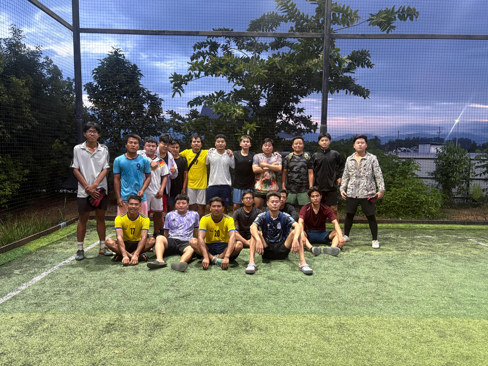
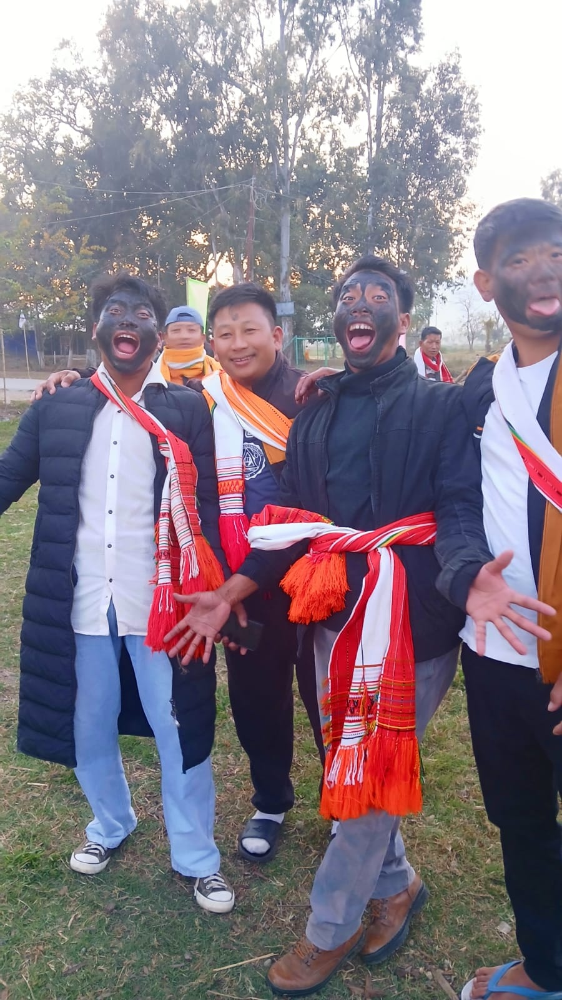
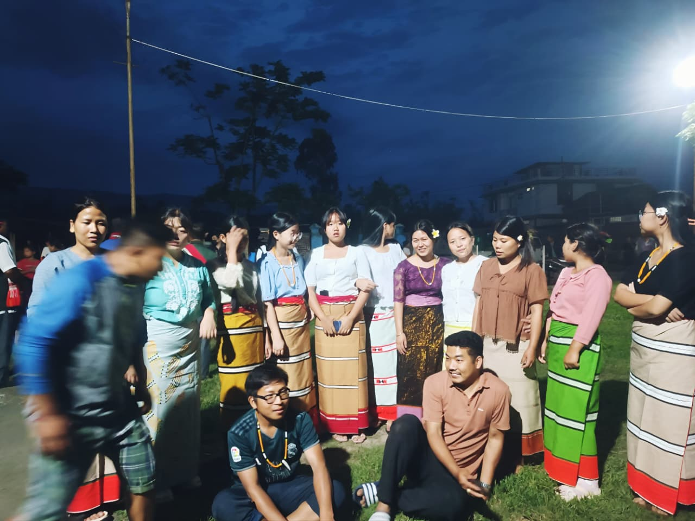
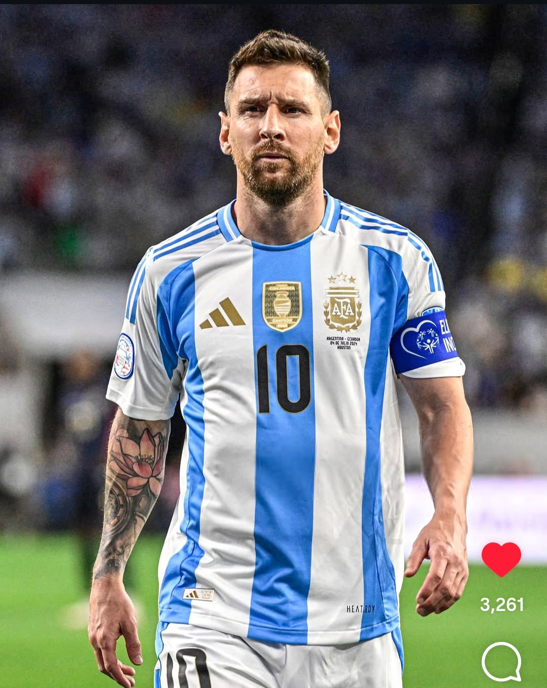
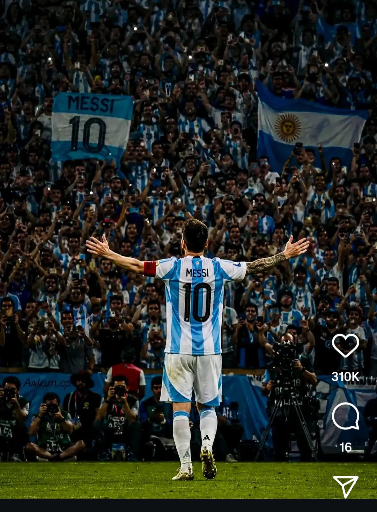
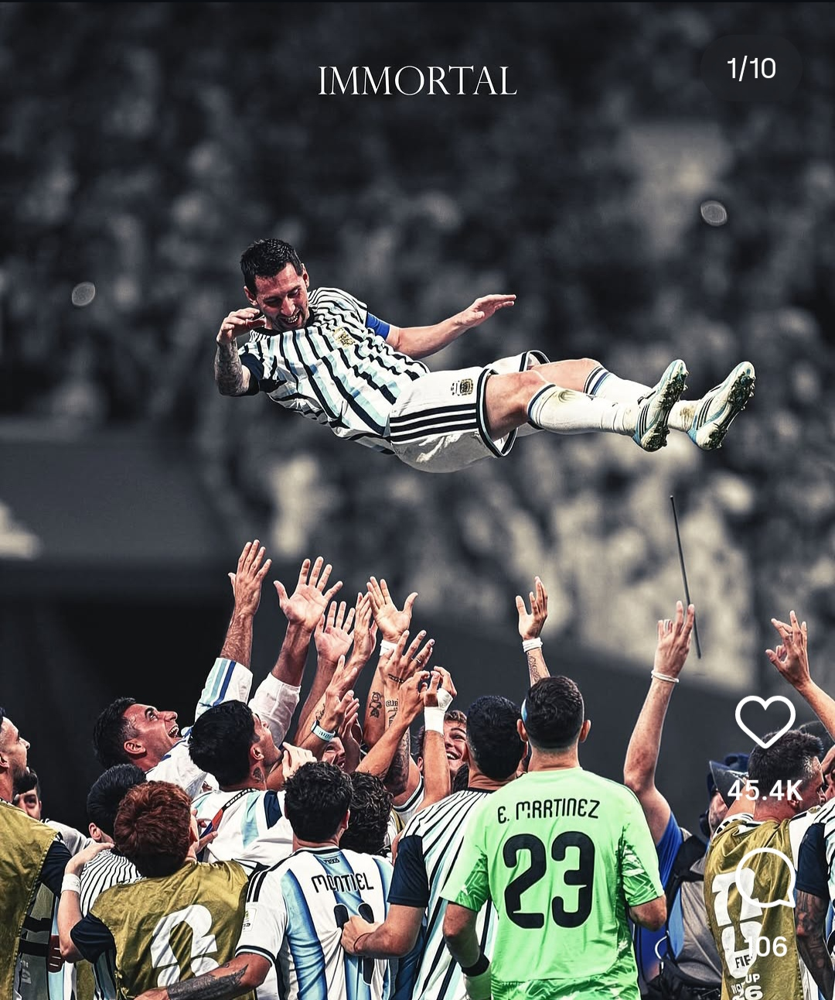

<!DOCTYPE html>
<html lang="en">
<head>
<meta charset="UTF-8">
<meta name="viewport" content="width=device-width, initial-scale=1.0">
<title>Our WhatsApp Group Memories</title>

</head>
<body>

<h1>📸 Our WhatsApp Group Memories</h1>

    
    
    
    
    
    

😂 Imagine if Messi lifted the 2026 World Cup!  
This page is just for fun! 💙🤍

</body>
</html>
